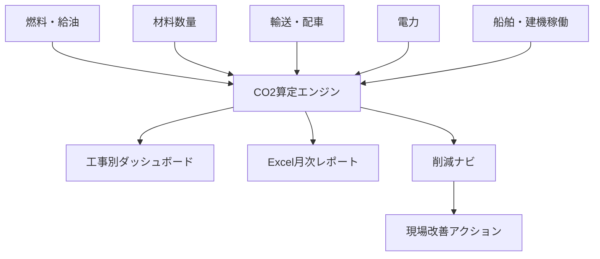
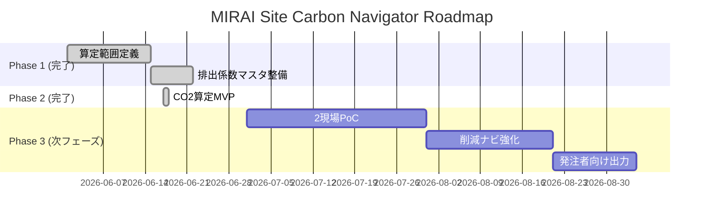

# MIRAI Site Carbon Navigator


## 🎯 プロジェクト概要

**MIRAI Site Carbon Navigator** は、建設現場のCO2排出量を自動算定し、削減施策まで提示する脱炭素支援システムです。

船舶・建機・燃料・材料・輸送・電力のデータを集め、SBTiやSDGsの取り組みを現場改善と発注者提案へ接続します。

## 🌱 システム全体像



## 🏗️ アーキテクチャ

```
app/
├── main.py              # FastAPI エントリポイント
├── database.py          # SQLite / SQLAlchemy 設定
├── models.py            # ORM モデル (4テーブル)
├── schemas.py           # Pydantic v2 スキーマ
├── crud.py              # DB 操作
├── routers/
│   ├── projects.py      # 工事管理 API
│   ├── factors.py       # 排出係数 API
│   ├── activities.py    # 活動量 API
│   ├── emissions.py     # CO2算定 API
│   └── reports.py       # レポート出力 API
└── services/
    ├── calculator.py    # CO2算定エンジン
    ├── reduction.py     # 削減ナビロジック
    └── reporter.py      # Excel レポート生成
frontend/
├── index.html           # Bootstrap 5 SPA
└── static/
    ├── css/style.css
    └── js/app.js
tests/                   # pytest (59件)
```

## 🚀 クイックスタート

### ローカル起動

```bash
# 依存パッケージインストール
pip install -r requirements.txt

# 初期排出係数データ投入
python seed_data.py

# サーバー起動
uvicorn app.main:app --reload --port 8000
```

ブラウザで `http://localhost:8000` を開くとダッシュボードが表示されます。
API ドキュメントは `http://localhost:8000/docs` で確認できます。

### Docker 起動

```bash
docker-compose up --build
# → http://localhost:8000
```

## 📊 機能一覧

| ID | 機能 | 状態 |
|---|---|---|
| F-01 | 工事登録 | ✅ 実装済み |
| F-02 | 活動量登録 | ✅ 実装済み |
| F-03 | 排出係数管理 | ✅ 実装済み |
| F-04 | CO2算定 | ✅ 実装済み |
| F-05 | 月次レポート (Excel) | ✅ 実装済み |
| F-06 | 削減ナビ | ✅ 実装済み |
| F-07 | 発注者向け出力 | 🔄 次フェーズ |

## 🧮 算定式

```
CO2排出量 (kg) = 活動量 × 排出係数
```

| カテゴリ | 品目例 | 排出係数 |
|---|---|---|
| fuel (燃料) | 軽油 | 2.58 kg-CO2/L |
| fuel (燃料) | A重油 | 2.71 kg-CO2/L |
| power (電力) | 電力 | 0.434 kg-CO2/kWh |
| material (材料) | 鋼材 | 2,000 kg-CO2/t |
| transport (輸送) | 一般輸送 | 0.172 kg-CO2/t-km |

> 出典: 環境省 排出係数

## 🔐 ロール設計

| ロール | 権限 |
|---|---|
| CarbonAdmin | 係数・マスタ・全工事管理 |
| EnvironmentReviewer | 承認・レポート確認 |
| SiteInput | 担当工事の活動量登録 |
| Viewer | 閲覧のみ |

## 🧪 テスト

```bash
pip install pytest httpx
pytest tests/ -v
# → 59 passed
```

## 📋 API エンドポイント

| Method | Path | 説明 |
|---|---|---|
| POST | /api/projects | 工事登録 |
| GET | /api/projects | 工事一覧 |
| POST | /api/activities | 活動量登録 |
| POST | /api/activities/bulk | 一括登録 |
| PUT | /api/activities/{id}/approve | 活動量承認 |
| POST | /api/factors | 排出係数登録 |
| POST | /api/emissions/calculate | CO2算定実行 |
| GET | /api/emissions/summary | カテゴリ別集計 |
| GET | /api/emissions/reduction/{project}/{month} | 削減ナビ |
| GET | /api/reports/monthly/{project}/{month} | Excel レポート |

## 🗺️ ロードマップ



## ✅ 受入条件確認

1. ✅ 2現場分の月次データを登録できる
2. ✅ 工事別・カテゴリ別CO2が表示される
3. ✅ 排出係数を変更した場合、再計算結果を確認できる
4. ✅ 月次レポートをExcelで出力できる
5. ✅ 算定根拠を追跡できる（活動量→係数→算定結果の連鎖）

## 📄 関連ドキュメント

- [要件定義書](./requirements.md)
- [詳細設計仕様書](./detailed-design.md)
