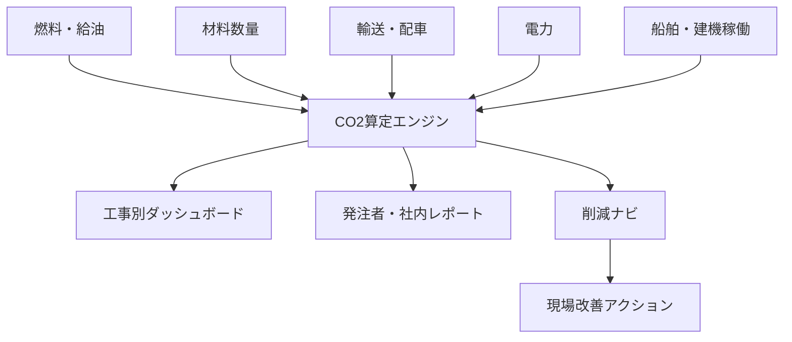
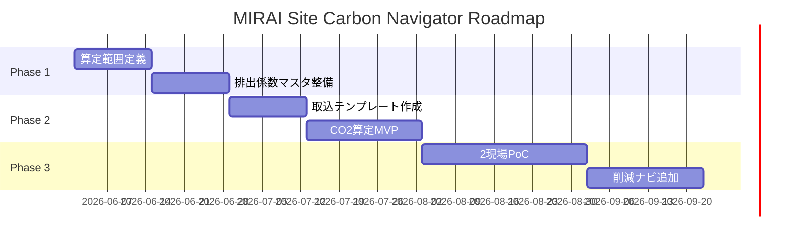

# MIRAI Site Carbon Navigator

## 🎯 プロジェクト概要

**MIRAI Site Carbon Navigator** は、工事別のCO2排出量を自動算定し、削減施策まで提示する脱炭素支援システムです。

船舶、建機、燃料、材料、輸送、電力のデータを集め、SBTiやSDGsの取り組みを現場改善と発注者提案へ接続します。

## 🌱 全体像

## 🧩 MVPスコープ

| 項目 | 内容 |
|---|---|
| 対象 | 港湾工事1件、陸上工事1件 |
| データ | 燃料、主要材料、輸送距離、現場電力 |
| 出力 | 工事別CO2、月次推移、削減候補 |
| 方式 | Excel/CSV取込 + Web/BI画面 |
| レビュー | 環境担当・現場所長による月次確認 |

## 👥 役割分担

| 担当 | 役割 |
|---|---|
| PM | 算定ルール、データ設計、全体設計 |
| ノーコード担当 | 入力フォーム、月次確認画面 |
| 元システム管理者 | CSV収集、ファイル置場、権限 |
| プログラミング担当 | 排出係数マスタ、算定ロジック |
| 部長 | 環境部門・現場部門との調整 |

## 🗺 ロードマップ

## ✅ 成功指標

- CO2算定に必要な月次集計時間を50%削減
- 工事別CO2を月次で可視化
- 削減施策を現場単位で3件以上提示
- 発注者向け環境提案資料に転用可能

## 📄 関連ドキュメント

- [要件定義書](./requirements.md)
- [詳細設計仕様書](./detailed-design.md)
