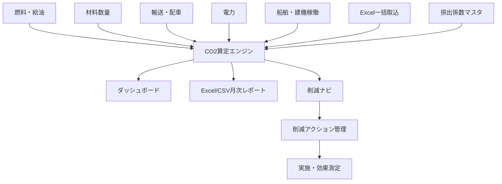
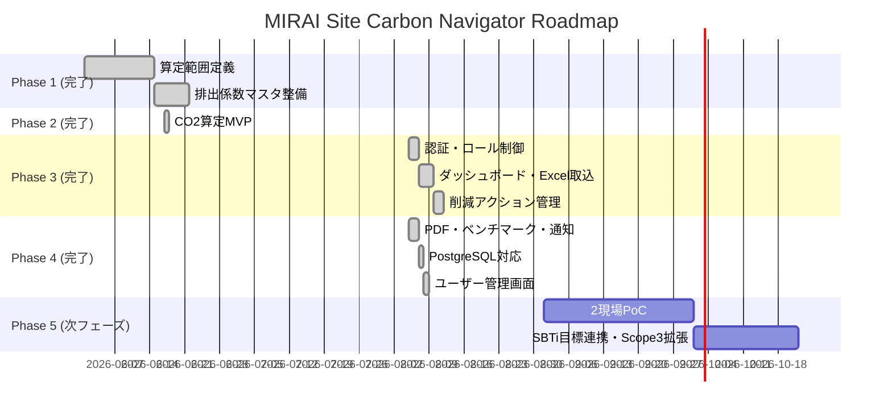

# MIRAI Site Carbon Navigator

## 🎯 プロジェクト概要

**MIRAI Site Carbon Navigator** は、建設現場のCO2排出量を自動算定し、削減施策まで提示する脱炭素支援システムです。

燃料・建機・船舶・材料・輸送・電力・廃棄物のデータを集め、SBTiやSDGsの取り組みを現場改善と発注者提案へ接続します。既存人気製品（環境クラウド・CO2算定SaaS等）の**80〜90%代替**を目標に、現場入力→承認→算定→レポート→削減アクション管理の一連のワークフローをWebアプリで完結させます。

## 🌱 システム全体像



## 🏗️ アーキテクチャ

```
app/
├── main.py              # FastAPI エントリポイント
├── database.py          # SQLite / SQLAlchemy + 軽量マイグレーション
├── models.py            # ORM モデル (工事・係数・活動量・算定結果・ユーザー・アクション・監査)
├── schemas.py           # Pydantic v2 スキーマ + 入力検証
├── security.py          # PBKDF2パスワード / HMACトークン / ロール制御
├── crud.py              # DB 操作 + 監査ログ記録
├── routers/
│   ├── auth.py          # ログイン・セッション
│   ├── users.py         # ユーザー管理 (Admin)
│   ├── projects.py      # 工事 CRUD
│   ├── factors.py       # 排出係数 CRUD
│   ├── activities.py    # 活動量 CRUD・承認・Excel一括取込
│   ├── emissions.py     # 算定・集計・トレンド・カバレッジ・削減ナビ
│   ├── reports.py       # Excel/CSVレポート
│   ├── actions.py       # 削減アクション管理
│   └── audit.py         # 監査ログ
└── services/
    ├── calculator.py    # CO2算定エンジン (対象月時点の係数適用)
    ├── reduction.py     # 削減ナビロジック
    └── reporter.py      # Excel/CSVレポート生成・取込テンプレート
frontend/
├── index.html           # Bootstrap 5 SPA (ログイン・ダッシュボード・各管理画面)
└── static/
    ├── css/style.css
    └── js/app.js
tests/                   # pytest (101件)
```

## 🚀 クイックスタート

### ローカル起動

```bash
pip install -r requirements.txt
python seed_data.py
uvicorn app.main:app --reload --port 8000
```

ブラウザで `http://localhost:8000` を開くとログイン画面が表示されます。
API ドキュメントは `http://localhost:8000/docs` で確認できます。

### Docker 起動

```bash
docker-compose up --build
# → http://localhost:8000
```

## 🔐 ログイン（開発用デフォルト）

| ユーザー名 | パスワード | ロール | 権限 |
|---|---|---|---|
| admin | admin123 | CarbonAdmin | 係数・ユーザー・全データ管理、削除 |
| reviewer | reviewer123 | EnvironmentReviewer | 活動量承認・監査ログ閲覧・削減アクション削除 |
| site | site123 | SiteInput | 工事・活動量・削減アクションの登録/編集 |
| viewer | viewer123 | Viewer | 閲覧のみ |

> ⚠️ 開発用の初期パスワードです。本番投入前に必ず変更してください。

## 📊 機能一覧

| ID | 機能 | 状態 |
|---|---|---|
| F-01 | 工事 CRUD（登録・更新・削除） | ✅ 実装済み |
| F-02 | 活動量 CRUD + 承認ワークフロー | ✅ 実装済み |
| F-03 | 排出係数マスタ CRUD（適用開始日で版管理） | ✅ 実装済み |
| F-04 | CO2算定（対象月時点の係数適用・係数スナップショット） | ✅ 実装済み |
| F-05 | 月次レポート（Excel/CSV/PDF） | ✅ 実装済み |
| F-06 | 削減ナビ + 削減アクション管理 | ✅ 実装済み |
| F-07 | ダッシュボード（全社/工事別推移・カテゴリ構成） | ✅ 実装済み |
| F-08 | Excel一括取込 + テンプレート配布 | ✅ 実装済み |
| F-09 | ログイン・ロール制御（4ロール） | ✅ 実装済み |
| F-10 | 監査ログ（登録・変更・承認・削除・ログイン） | ✅ 実装済み |
| F-11 | 未算定活動の可視化（係数未設定データ） | ✅ 実装済み |
| F-12 | 発注者向けPDF出力 | ✅ 実装済み |
| F-13 | 同工種ベンチマーク + 異常値検知（前月比・3ヶ月平均比） | ✅ 実装済み |
| F-14 | 通知（ベル・未読管理・イベント通知） | ✅ 実装済み |
| F-15 | PostgreSQL対応（Docker Compose構成） | ✅ 実装済み |
| F-16 | ユーザー管理画面（作成・編集・有効/無効化） | ✅ 実装済み |

## 🧮 算定方式

```
CO2排出量 (kg) = 活動量 × 排出係数
```

- 承認済み活動量のみ算定対象
- 排出係数は **対象月の末日時点で有効な最新版** を適用（未来日付の改定は過去月に影響しない）
- 算定結果には **適用した係数値・出典・適用開始日をスナップショット保存** するため、後から係数が変わってもレポートの根拠が追跡可能

| カテゴリ | 品目例 | 排出係数 |
|---|---|---|
| fuel (燃料) | 軽油 | 2.58 kg-CO2/L |
| fuel (燃料) | A重油 | 2.71 kg-CO2/L |
| power (電力) | 電力 | 0.434 kg-CO2/kWh |
| material (材料) | 鋼材 | 2,000 kg-CO2/t |
| transport (輸送) | 一般輸送 | 0.172 kg-CO2/t-km |
| machine (建機) | 油圧ショベル | 18.5 kg-CO2/h (目安) |
| ship (船舶) | 作業船 | 120 kg-CO2/h (目安) |

> 出典: 環境省 排出係数ほか（seed_data.py にて投入）

## 🔌 主なAPI

| Method | Path | 説明 | 必要ロール |
|---|---|---|---|
| POST | /api/auth/login | ログイン | - |
| GET | /api/emissions/dashboard | 全体ダッシュボード | viewer〜 |
| POST | /api/projects | 工事登録 | site〜 |
| PUT | /api/projects/{id} | 工事更新 | site〜 |
| DELETE | /api/projects/{id} | 工事削除 | admin |
| POST | /api/factors | 係数登録 | admin |
| PUT/DELETE | /api/factors/{id} | 係数更新/削除 | admin |
| POST | /api/activities | 活動量登録 | site〜 |
| PUT | /api/activities/{id}/approve | 承認/取消 | reviewer〜 |
| PUT/DELETE | /api/activities/{id} | 活動量更新/削除 | site〜 |
| POST | /api/activities/import | Excel一括取込 | site〜 |
| GET | /api/activities/template | 取込テンプレート | site〜 |
| POST | /api/emissions/calculate | CO2算定 | viewer〜 |
| GET | /api/emissions/trend | 月次トレンド | viewer〜 |
| GET | /api/emissions/missing-factors | 係数未設定一覧 | viewer〜 |
| GET | /api/emissions/reduction/{project}/{month} | 削減ナビ | viewer〜 |
| GET | /api/reports/monthly/{project}/{month}?format=xlsx\|csv\|pdf | レポート出力 | viewer〜 |
| GET | /api/emissions/benchmark?project_id=&target_month= | 同工種ベンチマーク | viewer〜 |
| GET | /api/emissions/anomalies?project_id=&target_month= | 異常値検知 | viewer〜 |
| GET | /api/notifications | 通知一覧（未読フィルタ可） | viewer〜 |
| PUT | /api/notifications/{id}/read, /api/notifications/read-all | 既読管理 | viewer〜 |
| GET/POST/PUT/DELETE | /api/actions | 削減アクション管理 | 閲覧: viewer〜 / 編集: site〜 / 削除: reviewer〜 |
| GET | /api/audit-logs | 監査ログ | reviewer〜 |
| GET/POST/PUT | /api/users | ユーザー管理 | admin |

## 🔧 環境変数

| 変数 | デフォルト | 説明 |
|---|---|---|
| DATABASE_URL | sqlite:///./carbon_navigator.db | DB接続文字列 |
| MIRAI_SECRET_KEY | 起動時ランダム | トークン署名キー（本番は固定値を設定） |
| MIRAI_CORS_ORIGINS | http://localhost:8000,http://127.0.0.1:8000 | 許可オリジン（カンマ区切り） |

### PostgreSQL での起動（Docker Compose）

```bash
docker-compose up --build
# app → http://localhost:8000
# db  → postgresql+psycopg2://mirai:mirai@db:5432/mirai_carbon（コンテナ間接続のみ）
```

PostgreSQL は `docker-compose.yml` の `db` サービスで自動起動し、app は起動時にテーブル作成 + シードを実行します。データは `pgdata` ボリュームに永続化されます。

> ローカル開発を SQLite のまま行う場合は `DATABASE_URL=sqlite:///./carbon_navigator.db` を指定してください。

## 🧪 テスト

```bash
pip install -r requirements.txt pytest httpx
pytest tests/ -v
# → 101 passed
```

## 🗺️ ロードマップ



## 📄 関連ドキュメント

- [要件定義書](./requirements.md)
- [詳細設計仕様書](./detailed-design.md)
