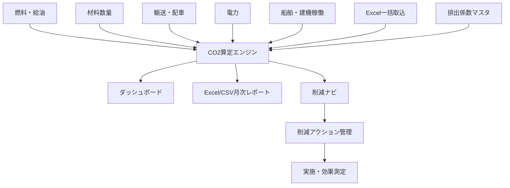
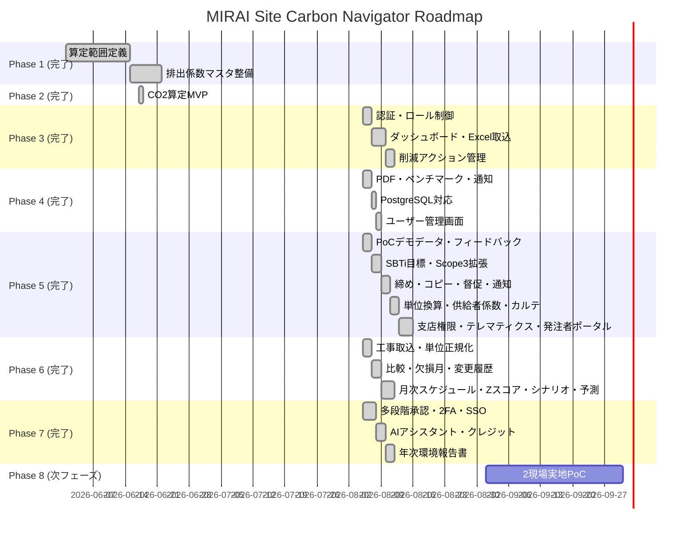

# MIRAI Site Carbon Navigator

## 🎯 プロジェクト概要

**MIRAI Site Carbon Navigator** は、建設現場のCO2排出量を自動算定し、削減施策まで提示する脱炭素支援システムです。

燃料・建機・船舶・材料・輸送・電力・廃棄物のデータを集め、SBTiやSDGsの取り組みを現場改善と発注者提案へ接続します。既存人気製品（環境クラウド・CO2算定SaaS等）の**80〜90%代替**を目標に、現場入力→承認→算定→レポート→削減アクション管理の一連のワークフローをWebアプリで完結させます。

## 🌱 システム全体像



## 🏗️ アーキテクチャ

```
app/
├── main.py              # FastAPI エントリポイント
├── database.py          # SQLite / SQLAlchemy + 軽量マイグレーション
├── models.py            # ORM モデル (工事・係数・活動量・算定結果・ユーザー・アクション・監査)
├── schemas.py           # Pydantic v2 スキーマ + 入力検証
├── security.py          # PBKDF2パスワード / HMACトークン / ロール制御
├── crud.py              # DB 操作 + 監査ログ記録
├── routers/
│   ├── auth.py          # ログイン・セッション
│   ├── users.py         # ユーザー管理 (Admin)
│   ├── projects.py      # 工事 CRUD
│   ├── factors.py       # 排出係数 CRUD
│   ├── activities.py    # 活動量 CRUD・承認・Excel一括取込
│   ├── emissions.py     # 算定・集計・トレンド・カバレッジ・削減ナビ
│   ├── reports.py       # Excel/CSVレポート
│   ├── actions.py       # 削減アクション管理
│   └── audit.py         # 監査ログ
└── services/
    ├── calculator.py    # CO2算定エンジン (対象月時点の係数適用)
    ├── reduction.py     # 削減ナビロジック
    └── reporter.py      # Excel/CSVレポート生成・取込テンプレート
frontend/
├── index.html           # Bootstrap 5 SPA (ログイン・ダッシュボード・各管理画面)
└── static/
    ├── css/style.css
    └── js/app.js
tests/                   # pytest (156件)
```

## 🚀 クイックスタート

### ローカル起動

```bash
pip install -r requirements.txt
python seed_data.py
uvicorn app.main:app --reload --port 8000
```

ブラウザで `http://localhost:8000` を開くとログイン画面が表示されます。
API ドキュメントは `http://localhost:8000/docs` で確認できます。

## 🌐 本番環境

- URL: https://carbon.mirai-dx-platform.com
- 構成: FastAPI（Docker）+ PostgreSQL 16 + Cloudflare Tunnel（mirai-dx-platform.com）
- バックアップ: `scripts/backup.sh`（毎日02:00、14世代保持）
- 監視: `scripts/monitor.sh`（5分毎、`logs/monitor.log`）
- 運用文書: [docs/operations/](./docs/operations/README.md)（SLO・Runbook・バックアップ/復元・監視・運用台帳・セキュリティ）

### Docker 起動

```bash
docker-compose up --build
# → http://localhost:8000
```

## 🔐 ログイン（開発用デフォルト）

| ユーザー名 | パスワード | ロール | 権限 |
|---|---|---|---|
| admin | admin123 | CarbonAdmin | 係数・ユーザー・全データ管理、削除 |
| reviewer | reviewer123 | EnvironmentReviewer | 活動量承認・監査ログ閲覧・削減アクション削除 |
| site | site123 | SiteInput | 工事・活動量・削減アクションの登録/編集 |
| viewer | viewer123 | Viewer | 閲覧のみ |
| client | （管理者が作成） | Client | 割当てられた工事の閲覧のみ（発注者向け） |

> ⚠️ 開発用の初期パスワードです。本番投入前に必ず変更してください。

## 📊 機能一覧

| ID | 機能 | 状態 |
|---|---|---|
| F-01 | 工事 CRUD（登録・更新・削除） | ✅ 実装済み |
| F-02 | 活動量 CRUD + 承認ワークフロー | ✅ 実装済み |
| F-03 | 排出係数マスタ CRUD（適用開始日で版管理） | ✅ 実装済み |
| F-04 | CO2算定（対象月時点の係数適用・係数スナップショット） | ✅ 実装済み |
| F-05 | 月次レポート（Excel/CSV/PDF） | ✅ 実装済み |
| F-06 | 削減ナビ + 削減アクション管理 | ✅ 実装済み |
| F-07 | ダッシュボード（全社/工事別推移・カテゴリ構成） | ✅ 実装済み |
| F-08 | Excel一括取込 + テンプレート配布 | ✅ 実装済み |
| F-09 | ログイン・ロール制御（4ロール） | ✅ 実装済み |
| F-10 | 監査ログ（登録・変更・承認・削除・ログイン） | ✅ 実装済み |
| F-11 | 未算定活動の可視化（係数未設定データ） | ✅ 実装済み |
| F-12 | 発注者向けPDF出力 | ✅ 実装済み |
| F-13 | 同工種ベンチマーク + 異常値検知（前月比・3ヶ月平均比） | ✅ 実装済み |
| F-14 | 通知（ベル・未読管理・イベント通知） | ✅ 実装済み |
| F-15 | PostgreSQL対応（Docker Compose構成） | ✅ 実装済み |
| F-16 | ユーザー管理画面（作成・編集・有効/無効化） | ✅ 実装済み |
| F-17 | PoCデモデータ生成（2現場×7ヶ月、ワンクリック） | ✅ 実装済み |
| F-18 | 現場フィードバック（登録・対応状況管理） | ✅ 実装済み |
| F-19 | SBTi目標管理（Scope別削減目標・進捗・順調判定） | ✅ 実装済み |
| F-20 | Scope3拡張（GHG Protocol分類・Scope別集計・出張/通勤/水） | ✅ 実装済み |
| F-21 | 月次締め・確定ロック（締め後は登録/編集/承認/再算定をブロック） | ✅ 実装済み |
| F-22 | 前月データのコピー作成 | ✅ 実装済み |
| F-23 | 未入力督促一覧 + 督促通知 | ✅ 実装済み |
| F-24 | メール(SMTP)/Teams通知（環境変数で有効化） | ✅ 実装済み |
| F-25 | 全量エクスポート（ZIP/JSONバックアップ） | ✅ 実装済み |
| F-26 | 活動量コメントスレッド | ✅ 実装済み |
| F-27 | 電気事業者別排出係数 + 単位換算エンジン | ✅ 実装済み |
| F-28 | 工事カルテPDF（全期間サマリー） | ✅ 実装済み |
| F-29 | 支店マスタ + 支店別権限（siteは自支店のみ操作） | ✅ 実装済み |
| F-30 | テレマティクス連携（シミュレータ/コマツAPIアダプタ） | ✅ 実装済み |
| F-31 | 発注者ポータル（clientロール・工事別アクセス割当・閲覧のみ） | ✅ 実装済み |
| F-32 | 工事マスタ一括取込（Excelテンプレート + 取込API） | ✅ 実装済み |
| F-33 | 活動量の単位自動換算（kL→L 等を登録時に正規化） | ✅ 実装済み |
| F-34 | 前月比・前年比カード + データ欠損月の警告 | ✅ 実装済み |
| F-35 | 活動量の変更履歴（CO2影響の差分表示） | ✅ 実装済み |
| F-36 | 月次スケジュール（締め日・残日数・未承認件数の一覧） | ✅ 実装済み |
| F-37 | Zスコアによる統計的異常値検知 | ✅ 実装済み |
| F-38 | 削減シナリオシミュレーション（Scope別影響試算） | ✅ 実装済み |
| F-39 | 翌月排出量予測（線形トレンド） | ✅ 実装済み |
| F-40 | 多段階承認フロー（下書き→現場提出→支店承認→環境部承認） | ✅ 実装済み |
| F-41 | TOTP二要素認証（セキュリティ設定画面） | ✅ 実装済み |
| F-42 | SSO/OIDCログイン（Entra ID等、自動ユーザープロビジョニング） | ✅ 実装済み |
| F-43 | AI削減アシスタント（同工種の削減実績・ベンチマークに基づく提案） | ✅ 実装済み |
| F-44 | カーボンクレジット管理（J-クレジット/再エネ証書の充当・無効化） | ✅ 実装済み |
| F-45 | 年次環境報告書PDFの自動生成 | ✅ 実装済み |

## 🧮 算定方式

```
CO2排出量 (kg) = 活動量 × 排出係数
```

- 承認済み活動量のみ算定対象
- 排出係数は **対象月の末日時点で有効な最新版** を適用（未来日付の改定は過去月に影響しない）
- 算定結果には **適用した係数値・出典・適用開始日をスナップショット保存** するため、後から係数が変わってもレポートの根拠が追跡可能

| カテゴリ | 品目例 | 排出係数 |
|---|---|---|
| fuel (燃料) | 軽油 | 2.58 kg-CO2/L |
| fuel (燃料) | A重油 | 2.71 kg-CO2/L |
| power (電力) | 電力 | 0.434 kg-CO2/kWh |
| material (材料) | 鋼材 | 2,000 kg-CO2/t |
| transport (輸送) | 一般輸送 | 0.172 kg-CO2/t-km |
| machine (建機) | 油圧ショベル | 18.5 kg-CO2/h (目安) |
| ship (船舶) | 作業船 | 120 kg-CO2/h (目安) |
| business_travel (出張) | 出張(鉄道) | 0.021 kg-CO2/人-km |
| commuting (通勤) | 通勤(車) | 0.130 kg-CO2/人-km |
| water (水) | 上水道 | 0.360 kg-CO2/m3 (目安) |

> 出典: 環境省 排出係数ほか（seed_data.py にて投入）

### GHG Protocol Scope 分類

| Scope | 対象カテゴリ |
|---|---|
| Scope1 直接排出 | fuel（燃料）、machine（建機）、ship（船舶） |
| Scope2 エネルギー間接排出 | power（電力） |
| Scope3 その他間接排出 | material（材料）、transport（輸送）、waste（廃棄物）、business_travel（出張）、commuting（通勤）、water（水） |

Scope別集計は算定画面のカード、Excel/CSV/PDFレポートの「Scope別集計」で確認できます。

## 🔌 主なAPI

| Method | Path | 説明 | 必要ロール |
|---|---|---|---|
| POST | /api/auth/login | ログイン | - |
| GET | /api/emissions/dashboard | 全体ダッシュボード | viewer〜 |
| POST | /api/projects | 工事登録 | site〜 |
| PUT | /api/projects/{id} | 工事更新 | site〜 |
| DELETE | /api/projects/{id} | 工事削除 | admin |
| POST | /api/factors | 係数登録 | admin |
| PUT/DELETE | /api/factors/{id} | 係数更新/削除 | admin |
| POST | /api/activities | 活動量登録 | site〜 |
| PUT | /api/activities/{id}/approve | 承認/取消 | reviewer〜 |
| PUT/DELETE | /api/activities/{id} | 活動量更新/削除 | site〜 |
| POST | /api/activities/import | Excel一括取込 | site〜 |
| GET | /api/activities/template | 取込テンプレート | site〜 |
| POST | /api/activities/copy-previous | 前月データのコピー | site〜 |
| GET/POST/DELETE | /api/activities/{id}/comments | コメントスレッド | 閲覧: viewer〜 / 投稿: site〜 / 削除: reviewer〜 |
| POST | /api/emissions/calculate | CO2算定 | viewer〜 |
| GET | /api/emissions/trend | 月次トレンド | viewer〜 |
| GET | /api/emissions/missing-factors | 係数未設定一覧 | viewer〜 |
| GET | /api/emissions/reduction/{project}/{month} | 削減ナビ | viewer〜 |
| GET | /api/emissions/scope-summary?project_id=&target_month=&year= | Scope別集計 | viewer〜 |
| GET | /api/emissions/reminders?target_month= | 督促一覧 | viewer〜 |
| POST/DELETE | /api/closes | 月次締め/締め解除 | 締め: reviewer〜 / 解除: admin |
| GET | /api/reports/monthly/{project}/{month}?format=xlsx\|csv\|pdf | レポート出力 | viewer〜 |
| GET | /api/emissions/benchmark?project_id=&target_month= | 同工種ベンチマーク | viewer〜 |
| GET | /api/emissions/anomalies?project_id=&target_month= | 異常値検知 | viewer〜 |
| GET | /api/notifications | 通知一覧（未読フィルタ可） | viewer〜 |
| PUT | /api/notifications/{id}/read, /api/notifications/read-all | 既読管理 | viewer〜 |
| POST | /api/notifications/remind | 督促送信 | admin |
| POST | /api/units/convert | 単位換算 | viewer〜 |
| GET | /api/branches | 支店一覧 | viewer〜 |
| POST/DELETE | /api/branches | 支店管理 | admin |
| GET/POST | /api/telematics/import | テレマティクス取込 | site〜 |
| GET | /api/export/full | 全量バックアップ(ZIP) | admin |
| GET | /api/reports/card/{project_id} | 工事カルテPDF | viewer〜（clientは割当工事のみ） |
| GET/PUT | /api/users/{id}/projects | 発注者への工事アクセス割当 | admin |
| GET | /api/projects/template | 工事取込テンプレート | site〜 |
| POST | /api/projects/import | 工事一括取込 | site〜 |
| GET | /api/emissions/comparison?project_id=&target_month= | 前月比/前年比 | viewer〜 |
| GET | /api/emissions/missing-months?project_id= | 欠損月一覧 | viewer〜 |
| GET | /api/emissions/forecast?project_id= | 翌月予測 | viewer〜 |
| POST | /api/emissions/scenario-simulate | 削減シナリオ試算 | viewer〜 |
| GET | /api/emissions/month-status?target_month= | 月次スケジュール | viewer〜 |
| GET | /api/activities/{id}/history | 活動量変更履歴 | viewer〜 |
| PUT | /api/activities/{id}/approval | 多段階承認（submit/approve_branch/approve_env/reject） | 提出: site〜 / 承認系: reviewer〜 |
| POST | /api/auth/2fa/setup・verify・disable | 二要素認証の設定/解除 | 本人 |
| POST | /api/auth/2fa/login | 二要素コードでのログイン | - |
| GET | /api/auth/oidc/login・callback・status | SSOログイン | - |
| GET | /api/assistant/suggestions?project_id=&target_month= | AI削減アシスタント | viewer〜 |
| GET/POST | /api/credits | クレジット一覧/登録 | 登録: admin / 閲覧: viewer〜 |
| POST | /api/credits/{id}/allocate・retire | 充当/無効化 | 充当: reviewer〜 / 無効化: admin |
| GET | /api/credits/summary | クレジット集計 | viewer〜 |
| GET | /api/reports/annual/{year} | 年次環境報告書PDF | viewer〜 |
| GET/POST/PUT/DELETE | /api/feedbacks | 現場フィードバック | 閲覧: viewer〜 / 編集: site〜 / 削除: reviewer〜 |
| GET | /api/sbti/progress | SBTi進捗 | viewer〜 |
| GET/POST/PUT/DELETE | /api/sbti/targets | SBTi目標管理 | 管理: admin / 閲覧: viewer〜 |
| GET | /api/demo/status | デモデータ状態 | viewer〜 |
| POST/DELETE | /api/demo/generate, /api/demo/clear | デモデータ生成/削除 | admin |
| GET/POST/PUT/DELETE | /api/actions | 削減アクション管理 | 閲覧: viewer〜 / 編集: site〜 / 削除: reviewer〜 |
| GET | /api/audit-logs | 監査ログ | reviewer〜 |
| GET/POST/PUT | /api/users | ユーザー管理 | admin |

## 🔧 環境変数

| 変数 | デフォルト | 説明 |
|---|---|---|
| DATABASE_URL | sqlite:///./carbon_navigator.db | DB接続文字列 |
| MIRAI_SECRET_KEY | 起動時ランダム | トークン署名キー（本番は固定値を設定） |
| MIRAI_CORS_ORIGINS | http://localhost:8000,http://127.0.0.1:8000 | 許可オリジン（カンマ区切り） |
| MIRAI_SMTP_HOST / PORT / USER / PASSWORD / FROM / TLS | 未設定 | メール通知（未設定ならDB通知のみ） |
| MIRAI_TEAMS_WEBHOOK | 未設定 | Teamsへの通知Webhook |
| MIRAI_TELEMATICS_MODE | disabled | disabled / simulator / komatsu |
| MIRAI_KOMATSU_BASE_URL / API_KEY | 未設定 | コマツ系テレマティクスAPI接続情報 |
| MIRAI_OIDC_ISSUER / CLIENT_ID / CLIENT_SECRET / REDIRECT_URI | 未設定 | SSO/OIDC（設定時のみ有効化） |
| MIRAI_FRONTEND_URL | http://localhost:8000 | OIDCコールバック後のリダイレクト先 |

### PostgreSQL での起動（Docker Compose）

```bash
docker-compose up --build
# app → http://localhost:8000
# db  → postgresql+psycopg2://mirai:mirai@db:5432/mirai_carbon（コンテナ間接続のみ）
```

PostgreSQL は `docker-compose.yml` の `db` サービスで自動起動し、app は起動時にテーブル作成 + シードを実行します。データは `pgdata` ボリュームに永続化されます。

> ローカル開発を SQLite のまま行う場合は `DATABASE_URL=sqlite:///./carbon_navigator.db` を指定してください。

## 🧪 テスト

```bash
pip install -r requirements.txt pytest httpx
pytest tests/ -v
# → 156 passed
```

## 🗺️ ロードマップ



## 📄 関連ドキュメント

- [要件定義書](./requirements.md)
- [詳細設計仕様書](./detailed-design.md)
