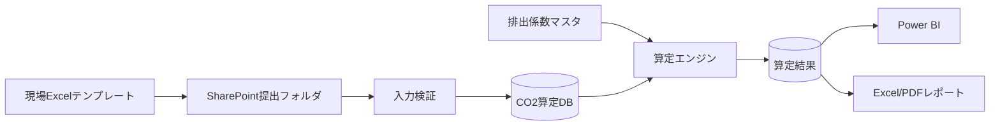
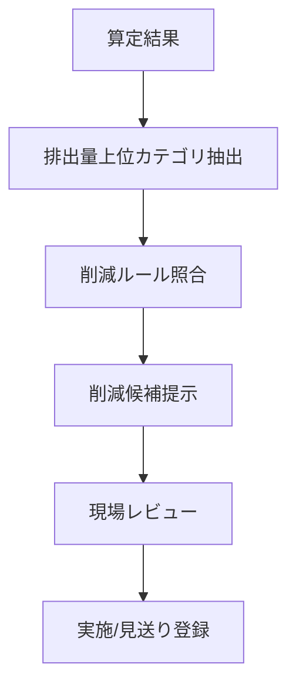

# MIRAI Site Carbon Navigator 詳細設計仕様書

## 1. 推奨アーキテクチャ

初期は Excelテンプレート、SharePoint、Python/Power Automate算定、Power BIを組み合わせる。将来はWeb入力とAPI化に移行する。

## 2. データモデル

### emission_factors

| カラム | 型 | 説明 |
|---|---|---|
| factor_id | string | 係数ID |
| category | string | fuel / power / material / transport |
| item_name | string | 軽油、電力、鋼材等 |
| unit | string | L, kWh, t, t-km |
| factor_value | number | 排出係数 |
| effective_from | date | 適用開始日 |
| source | string | 出典 |

### activity_data

| カラム | 型 | 説明 |
|---|---|---|
| activity_id | string | 活動量ID |
| project_id | string | 工事ID |
| target_month | string | 対象月 |
| category | string | カテゴリ |
| item_name | string | 品目 |
| quantity | number | 数量 |
| unit | string | 単位 |
| source_file | string | 元ファイル |
| approved | boolean | 承認状態 |

### emission_results

| カラム | 型 | 説明 |
|---|---|---|
| result_id | string | 結果ID |
| activity_id | string | 活動量ID |
| factor_id | string | 係数ID |
| co2_kg | number | CO2排出量kg |
| calculated_at | datetime | 算定日時 |

## 3. 入力検証

| 検証 | 内容 |
|---|---|
| 必須チェック | 工事ID、対象月、品目、数量、単位 |
| 型チェック | 数量が数値、対象月が年月形式 |
| 単位チェック | 排出係数マスタに存在する単位か |
| 重複チェック | 同一工事・月・品目の二重登録 |
| しきい値チェック | 前月比200%以上など異常値を警告 |

## 4. 削減ナビロジック

削減ルール例:

| 条件 | 提案 |
|---|---|
| 船舶燃料が上位 | 待機時間削減、工程再配置、海象予測活用 |
| 輸送CO2が上位 | 積載率改善、近隣調達、共同配送 |
| 材料CO2が上位 | 低炭素材料、再生材、設計数量見直し |
| 電力CO2が上位 | 再エネ電力、仮設電源見直し |

## 5. 権限設計

| ロール | 権限 |
|---|---|
| CarbonAdmin | 係数、マスタ、全工事管理 |
| EnvironmentReviewer | 承認、レポート確認 |
| SiteInput | 担当工事の活動量登録 |
| Viewer | 閲覧のみ |

## 6. テスト観点

- 排出係数変更時に再計算できるか
- 単位不一致を検知できるか
- 前月比異常値を警告できるか
- レポート数値とDB集計が一致するか
- 承認前データが公式レポートに含まれないか
